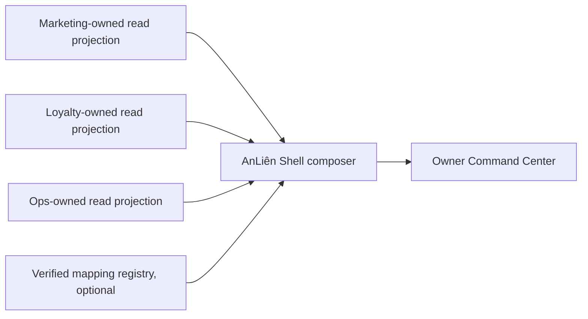

# AnLiên Read Projection V1 Proposal

Proposal date: 2026-08-14
Status: design proposal only
Implementation authorization: not granted

## 1. Purpose

This document proposes the smallest read-only contracts needed for the AnLiên Shell to show truthful daily owner information from Marketing, Loyalty, and Ops.

It does not authorize APIs, database views, Edge Functions, cron jobs, deployments, identity mapping, or Shell integration. The product repositories remain independent. Each product owns its own calculation and publishes only a versioned read projection. Shell must not query another product's database directly.

## 2. Contract principles

1. The owner product defines the metric and computes it near its own source truth.
2. Product-local identifiers remain product-local. Similar names do not imply a canonical relationship.
3. canonical_business_ref and canonical_location_ref may be emitted only after the mapping registry status is VERIFIED.
4. A projection is read-only. Mutating quick actions require separate command contracts, authorization, idempotency, audit, and failure handling.
5. Every time-relative field is computed in the owning shop/location timezone and includes an as-of timestamp.
6. Missing, stale, partial, or unauthorized data is explicit. Shell never silently replaces it with demo data.
7. Identity mapping does not grant entitlement. Business membership is not employee membership.
8. Exact production values remain NOT VERIFIED until a live, authorized read path exists.

## 3. Common envelope

Every product projection should carry the following required metadata.

```json
{
  "schema_version": "1.0.0",
  "generated_at": "2026-08-14T03:00:00Z",
  "source_product": "ops",
  "source_system_id": {
    "organization_id": "product-local-id",
    "location_id": "product-local-id"
  },
  "scope": {
    "kind": "location",
    "timezone": "Asia/Ho_Chi_Minh",
    "local_date": "2026-08-14"
  },
  "health": {
    "status": "live",
    "as_of": "2026-08-14T02:59:50Z",
    "last_success_at": "2026-08-14T02:59:50Z",
    "expected_freshness_seconds": 300,
    "reason_code": null,
    "warnings": []
  },
  "data": {}
}
```

Required envelope fields:

| Field | Rule |
|---|---|
| schema_version | Semantic version of this product projection. Shell rejects unsupported major versions. |
| generated_at | UTC time the projection was generated. |
| source_product | marketing, loyalty, or ops. |
| source_system_id | Product-local IDs only. The key names may vary by product. |
| scope | kind, timezone, local_date, and product-local scope. |
| health | Status and freshness for this product projection, not a global Shell status. |
| data | Product-owned payload. Fields may be absent when semantics or permission are not ready. |

Optional canonical references:

```json
{
  "canonical_business_ref": "business:...",
  "canonical_location_ref": "location:..."
}
```

These two keys must be absent, not guessed, until a mapping is VERIFIED. The current audit did not find a verified runtime bridge, so V1 must work without them.

## 4. Marketing projection V1

### 4.1 Minimal payload

```json
{
  "schema_version": "1.0.0",
  "generated_at": "...",
  "source_product": "marketing",
  "source_system_id": {
    "shop_id": "marketing-shop-id"
  },
  "scope": {
    "kind": "business",
    "timezone": "Asia/Ho_Chi_Minh",
    "local_date": "2026-08-14"
  },
  "health": { "status": "live", "as_of": "..." },
  "data": {
    "brand_context": {
      "dna_status": "ready",
      "voice": ["..."],
      "audience": "...",
      "visual_style": ["..."],
      "promise": "...",
      "updated_at": "..."
    },
    "today": {
      "date": "2026-08-14",
      "recommended_action": "...",
      "activity": {},
      "content_ideas": [{}, {}, {}],
      "why_it_fits": ["..."],
      "context_signals": ["..."],
      "engine_version": "2.1.0"
    },
    "touchpoints": {
      "plan_id": "...",
      "ready_count": 0,
      "attention_count": 0,
      "items": []
    }
  }
}
```

### 4.2 Source mapping

| Projection field | Real source | Read rule | Readiness |
|---|---|---|---|
| brand_context.dna_status | shops.dna_status | Direct enum value | READY |
| brand_context.voice | brand_info.voice_keywords or approved current Brand DNA JSON path | Direct after selecting one authoritative source | PARTIAL |
| brand_context.audience | brand_info.target_customer or approved current Brand DNA JSON path | Direct after selecting one authoritative source | PARTIAL |
| brand_context.visual_style | brand_info.design_style/visual_concept or approved current Brand DNA JSON path | Direct after selecting one authoritative source | PARTIAL |
| brand_context.promise | Current Brand DNA typed field | Direct when non-empty | PARTIAL |
| today.* | marketingCalendarEngine v2.1.0 | Run for local_date using the current brand input; project its result and meta | READY |
| touchpoints.* | journey_plans, journey_plan_items | Aggregate the selected active plan using an approved status translation | PARTIAL |
| brand_context.dna_score | brand_info.dna_score/dna_completeness | Omit in V1 until formula_version is approved | BLOCKED |

The current persistent Matcha companion must not populate today.* because its Edge Function is paused by an immediate 403. The active deterministic calendar engine is the proposed source when the product or user invokes the capability. V1 must not imply an autonomous scheduled daily recommendation system.

### 4.3 Marketing decisions required

- Select the authoritative field path when both legacy brand_info columns and current Brand DNA JSON contain the same concept.
- Define active journey plan and translate item states into ready and attention.
- Approve a DNA formula before adding dna_score, including required fields, validation, weights, rounding, formula_version, calculated_at, and update triggers.

Overall Marketing projection readiness: **PARTIAL**. The daily recommendation and DNA status are ready; the percentage and touchpoint aggregation need definitions.

## 5. Loyalty projection V1

### 5.1 Minimal payload

```json
{
  "schema_version": "1.0.0",
  "generated_at": "...",
  "source_product": "loyalty",
  "source_system_id": {
    "shop_id": "loyalty-shop-id"
  },
  "scope": {
    "kind": "business",
    "timezone": "Asia/Ho_Chi_Minh",
    "local_date": "2026-08-14"
  },
  "health": { "status": "live", "as_of": "..." },
  "data": {
    "customers": {
      "total_active_memberships": 0,
      "new_members_today": 0
    },
    "activity": {
      "voucher_redemptions_today": 0,
      "valid_game_sessions_today": 0
    },
    "retention": null,
    "coverage": {
      "transaction_source": "manual_staff_bill_entry",
      "pos_connected": false,
      "complete_purchase_coverage": false
    }
  }
}
```

### 5.2 Source mapping

| Projection field | Real source | Read rule | Readiness |
|---|---|---|---|
| customers.total_active_memberships | shop_memberships joined to players | Count active memberships in shop scope | READY |
| customers.new_members_today | get_shop_dashboard or shop_memberships.created_at | Count memberships created on local_date | READY after wording approval |
| activity.voucher_redemptions_today | redemptions, with vouchers as reconciliation source | Count shop-scoped redemptions on local_date | READY |
| activity.valid_game_sessions_today | game_sessions | Count valid completed sessions on local_date | PARTIAL: lock status/timestamp rule |
| retention.inactive_observed_45d | valid staff_bill_entries, valid completed game_sessions, redemptions | Count distinct active memberships whose latest qualifying event is older than 45 local days | PARTIAL: semantic approval required |
| customers_today | Multiple possible event sources | Omit | BLOCKED |
| returning_customers_today | Multiple possible event sources | Omit | BLOCKED |
| feedback | NOT VERIFIED | Omit | BLOCKED |

### 5.3 Proposed inactive-observed definition

This definition is useful only if the product owner approves it:

1. Population: active shop_memberships in the selected Loyalty shop.
2. Qualifying event: latest timestamp among a valid staff_bill_entry, a valid completed game_session, or a voucher redemption for that membership/player and shop.
3. Boundary: last qualifying event strictly before local_date minus 45 days.
4. Never-active members: reported separately as never_observed_count, not silently mixed into inactive.
5. Coverage: always emit pos_connected=false and complete_purchase_coverage=false while bill capture is manual.
6. Label: No observed Loyalty activity for 45 days. Do not label it Customers who have not returned.

No returning metric should be projected until the owner selects a qualifying event and accepts the source-coverage limitation.

Overall Loyalty projection readiness: **PARTIAL**. Membership and voucher metrics are ready; retention is derivable; today/returning and feedback are blocked.

## 6. Ops projection V1

### 6.1 Minimal payload

```json
{
  "schema_version": "1.0.0",
  "generated_at": "...",
  "source_product": "ops",
  "source_system_id": {
    "organization_id": "ops-organization-id",
    "shop_id": "ops-location-id"
  },
  "scope": {
    "kind": "location",
    "timezone": "Asia/Ho_Chi_Minh",
    "local_date": "2026-08-14"
  },
  "health": { "status": "live", "as_of": "..." },
  "data": {
    "attendance": {
      "scheduled_employee_count": 0,
      "checked_in_employee_count": 0,
      "missing_employee_count": 0,
      "missing_items": []
    },
    "work": {
      "eligible_count": 0,
      "completed_count": 0,
      "overdue_count": 0
    },
    "reviews": {
      "pending_count": 0,
      "sla_breached_count": 0,
      "sla_minutes": 15,
      "evidence_attention_count": 0
    },
    "current_shift": null,
    "assignments": [],
    "checklists": []
  }
}
```

### 6.2 Source mapping

| Projection field | Real source | Read rule | Readiness |
|---|---|---|---|
| attendance.scheduled_employee_count | shift_assignments plus active employee memberships/staff_profiles | Count distinct scheduled active non-owner employees for location/date/shift | READY |
| attendance.checked_in_employee_count | attendance_checkins plus membership user mapping | Count distinct scheduled employees with a trusted valid check-in | READY |
| attendance.missing_items | Schedule minus valid check-ins | Apply approved grace period and leave/exclusion policy | PARTIAL |
| work.eligible_count | task_instances | Count scoped tasks in the approved window | READY after window lock |
| work.completed_count | task_instances status | Use active service completion rule; label completed, not correctly completed | READY |
| work.overdue_count | reportService active rule | todo/in_progress/needs_rework and overdue | READY |
| reviews.pending_count | task/submission/review state | Count current pending_review queue | READY |
| reviews.sla_breached_count | pending state, submitted_at, shops.review_sla_minutes | Compare elapsed time with location-configured SLA | READY |
| reviews.evidence_attention_count | submissions and submission_evidence | Apply approved missing/invalid/pending evidence rule | PARTIAL |
| current_shift | shift_assignments and shops.shift_hours | Resolve local current time, including overnight shift behavior | PARTIAL |
| assignments | task_instances plus membership/profile | Project active scoped items and privacy-safe names | READY |
| checklists | SOP/task step entities | Project current scoped task and required-step progress | READY |
| location performance | task_instances grouped by shop_id | Approved completion formula and window | PARTIAL |
| cash difference | NOT VERIFIED; workflow removed | Omit | BLOCKED |
| open issue | NOT VERIFIED; workflow removed | Omit | BLOCKED |

The employee denominator must never be generic memberships. It is the set of active non-owner employee records that are scheduled in the selected scope.

Overall Ops projection readiness: **READY** for the minimal P0 projection of attendance, overdue work, and review queue/SLA. Current-shift, evidence, and location-performance extensions remain partial.

## 7. Data health model

The current Shell IntegrationStatus of demo or not-connected is insufficient. It mixes source mode, network state, and freshness. V1 should separate three concepts.

### 7.1 Data mode

| Value | Meaning |
|---|---|
| demo | Values come from explicit fixtures. |
| live | Values come from an authorized product projection. |

### 7.2 Fetch state

| Value | Meaning |
|---|---|
| idle | No request has started. |
| loading | A request is in progress. |
| success | A projection was received and schema-valid. |
| error | The request or schema validation failed. |

### 7.3 Projection health

| Value | Meaning | Shell behavior |
|---|---|---|
| live | Fresh complete data within the expected interval | Show value and as-of time |
| stale | Last success exists but is older than the threshold | Show warning and last-success time; suppress misleading today labels when the local day changed |
| partial | Projection is usable but some declared source or field is unavailable | Show supported values and list missing sections |
| unavailable | Product cannot currently serve data | Preserve other product cards; show unavailable empty state |
| unauthorized | Identity is known but caller lacks product permission | Show permission state; never infer access from another product |
| not_configured | No source product mapping/configuration exists for this scope | Offer configuration/deep link only |
| error | Product returned an operational or schema error | Show retry path and correlation/reason code |
| demo | Explicit fixture response | Show Demo badge and never combine with live values in the same metric |

Recommended reason codes include SOURCE_TIMEOUT, SCHEMA_UNSUPPORTED, MAPPING_NOT_VERIFIED, PERMISSION_DENIED, SOURCE_PAUSED, SOURCE_PARTIAL, and NO_RECENT_SUCCESS. They should be stable codes, not user-facing prose.

## 8. Graceful degradation

Failures must be isolated by product and by section.

- If Marketing is unavailable, Ops and Loyalty remain visible. Marketing shows its last success only if clearly marked stale.
- If Loyalty is stale across the shop's local-day boundary, Shell suppresses today and returning values. It may retain total memberships with a stale timestamp.
- If Ops attendance is stale, Shell must not show 8/9 as though it is current. It shows Last updated and an unavailable/stale state because attendance drives immediate action.
- If one optional section is partial, the rest of the same projection remains usable.
- If a mapping is not verified, Shell may present separate product-local cards but must not aggregate their values into one canonical Business or Location total.
- Demo and live values must not be merged. A whole card or field is explicitly demo or live.
- A projection error never falls back silently to the polished demo fixture.

## 9. Shell composition and freshness



The Shell composer validates schema versions, preserves product health independently, and applies presentation wording. It does not reproduce business formulas that belong to a product.

Suggested initial freshness targets are design defaults, not current commitments:

| Projection section | Suggested target | Rationale |
|---|---:|---|
| Ops attendance and reviews | 1 to 5 minutes | Immediate owner action |
| Ops work/checklists | 5 minutes | Operational visibility |
| Loyalty daily activity | 5 to 15 minutes | Useful same-day signal, not real-time POS truth |
| Loyalty total membership/retention | 1 hour to daily | Lower urgency and heavier aggregation |
| Marketing today recommendation | Once per local day plus Brand DNA change | Deterministic daily output |
| Marketing Brand context/touchpoints | 15 minutes to 1 hour | Changes less frequently |

Each product owner must approve its actual service-level objective and stale threshold.

## 10. First five integration fields

| Order | Field | Source | Why first |
|---:|---|---|---|
| 1 | Ops scheduled/checked-in attendance | shift_assignments, memberships/staff_profiles, attendance_checkins | Highest daily urgency and direct support |
| 2 | Ops overdue work | task_instances and active reportService rule | Direct action list with low ambiguity |
| 3 | Ops pending review and SLA breach | task/review state, submitted_at, review_sla_minutes | Prevents work from waiting unnoticed |
| 4 | Loyalty total active shop memberships | shop_memberships joined to players | Stable customer-base truth without claiming visits |
| 5 | Marketing Brand DNA status and summary | shops.dna_status plus approved Brand DNA fields | Gives brand context without an unverified percentage |

The next field should be Loyalty voucher redemptions today, followed by Marketing's deterministic daily recommendation.

## 11. Delivery phases after approval

### P0

- Approve exact source scope and timezone for each product-local shop/location.
- Define the Ops attendance denominator and check-in grace period.
- Publish Ops attendance, overdue, pending-review, and SLA projection fields.
- Publish Loyalty total active membership.
- Publish Marketing dna_status and selected direct Brand DNA summary.
- Add per-product health metadata and schema validation.

### P1

- Add Marketing calendar-engine output and approved touchpoint aggregation.
- Add Loyalty voucher redemption, new membership, and approved inactive-observed metrics.
- Add Ops assignments, checklist progress, evidence attention, current shift, and location KPI.
- Add read-only deep links. Keep mutation outside the read contract.

### P2

- Add lower-priority segments and capability previews.
- Reconsider a versioned DNA percentage if the formula is approved.
- Consider command contracts for selected quick actions.
- Consider canonical references only after mapping becomes VERIFIED.

## 12. Explicit exclusions from V1

- Returning customers today and customers today.
- Loyalty feedback or ratings.
- Ops cash reconciliation or cash difference.
- Ops open incidents/issues.
- Automated Loyalty outreach or the 20 Xu recommendation.
- Cross-product permission mapping.
- Shell-originated product mutations.
- Guessed canonical Business or Location IDs.
- Any exact production value that has not been read through an authorized projection.

## 13. Readiness summary

| Product | Readiness | Ready now | Blocking decisions |
|---|---|---|---|
| Marketing | PARTIAL | DNA status, direct summary after source selection, deterministic daily recommendation | DNA percentage formula; touchpoint state translation; duplicated-field authority |
| Loyalty | PARTIAL | Total membership, new membership with wording, voucher redemptions | Today/returning definition; inactive event definition; game-session definition; no feedback source |
| Ops | READY for minimal P0 | Attendance, overdue work, review queue and SLA | Grace period; later evidence/current-shift/location formulas; cash and issue remain excluded |
| Cross-product composition | PARTIAL | Product-local cards with independent health | Verified Business/Location mapping and shared identity bridge |

## 14. Mutation record

This proposal changed documentation only. It did not create or alter any API, database object, migration, deployment, product feature, UI, fixture, role, identity mapping, or production data.

Production mutations: **NONE**.
